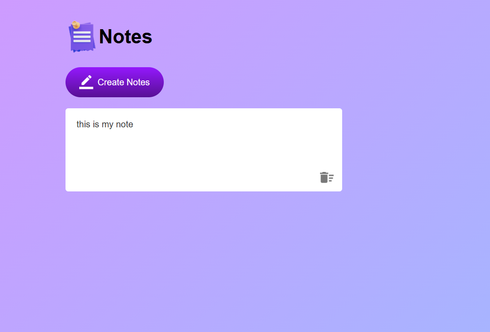

# 📝 Note App

Welcome to the **Note App** — a minimal and interactive web application built using **HTML**, **CSS**, and **JavaScript** that allows users to quickly jot down notes, save them automatically, and manage them with ease. 💡



---

## 🚀 Features

- ✍️ Create new notes with one click
- 💾 Auto-save to **Local Storage**
- 🗑️ One-click delete functionality
- 🎨 Clean and responsive UI
- ⌨️ Custom behavior for Enter key (line break only)

---

## 📁 Project Structure

```plaintext
📦 note-app/
├── 📄 index.html          # Main HTML structure
├── 🎨 note.css            # Styling and layout
├── ⚙️ note.js             # Functionality using JavaScript
└── 🖼️ images/             # All image assets (icons, etc.)

